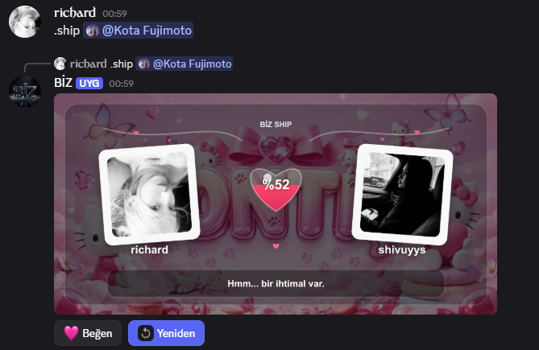

# JS14 DİSCORD • SHIP SYSTEM

> Discord sunucularınız için eğlenceli, modern ve tamamen özelleştirilebilir bir **Ship / Love Match sistemi**.

> Emojiler kendi sunucum için uyarlıdır kod içinden kendinize göre özelleştirebilirsiniz ^^
---

## Özellikler

- Rastgele **ship yüzdesi** oluşturma
- İki kullanıcının avatarlarını kart üzerinde gösterme
- Ortada özel kalp / yüzde tasarımı
- Modern ve estetik görsel tasarım
- Ship yüzdesine göre farklı açıklamalar
- **Yeniden** butonu ile yeni sonuç oluşturma
- **Beğen** butonu
- Hızlı ve kolay kullanım
- Kullanıcı avatarlarını otomatik olarak karta yerleştirme
- Yüzde bazlı eğlenceli eşleşme sistemi
- JSON tabanlı veri sistemi desteği
- Kolay özelleştirilebilir yapı

---

## Önizleme

---

## Gereksinimler , Modüller

- **Node.js 18+**
- **discord.js v14**
- **canvas**
- **sharp**

---

## Kurulum

Gerekli modülleri yüklemek için:

`npm install discord.js canvas sharp`

---

## Kullanım

Prefix sisteminizde:

`.ship @kullanıcı/ID`

Kullanıcı etiketlemeden çalıştırırsanız sistem sunucudaki rastgele bir gerçek üyeyi seçer.

---

## Özelleştirme

Ship görselinin arka planında kullanılacak bannerı `utils/shipSystem.js` içerisindeki `SHIP_BANNER` alanından değiştirebilirsiniz.

---

## Bağlantılar

[ (https://discord.gg/biz)

[ (https://guns.lol/vuruldun)

---
